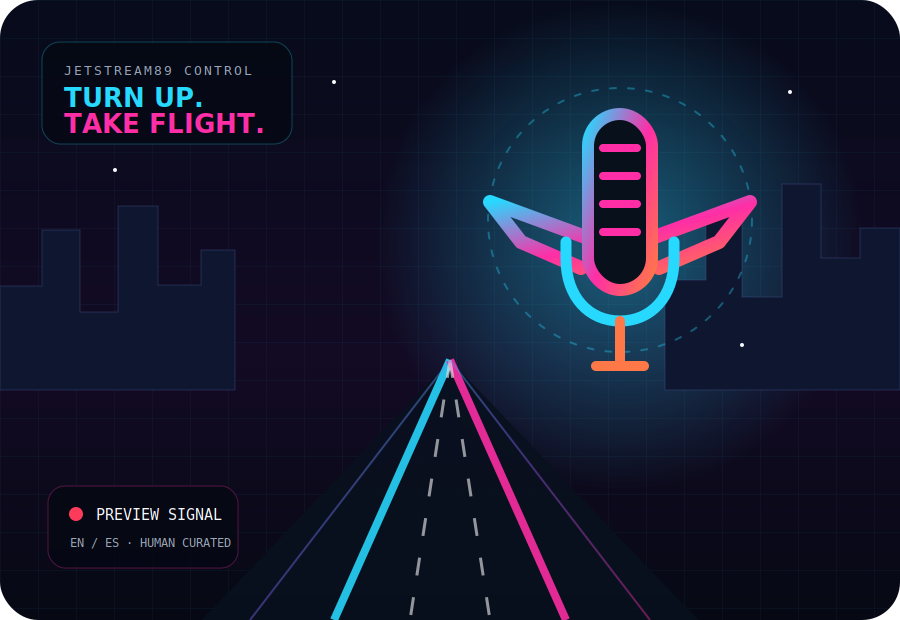

<p align="center">
  
</p>

<h1 align="center">📻 Jetstream89</h1>
<p align="center"><strong>Turn Up. Take Flight.</strong></p>
<p align="center">A bilingual, human-curated online rock-radio universe hosted by <strong>Jack Rodríguez</strong> and <strong>Kevin Cusnir</strong>.</p>

<p align="center">
  <a href="https://liriothteltanion.github.io/Jetstream89/">Live GitHub Pages site</a> ·
  <a href="schedule.html">Schedule</a> ·
  <a href="crew.html">Flight Crew</a> ·
  <a href="studio.html">Station Studio</a>
</p>

## ✈️ What Jetstream89 is

Jetstream89 combines a Spotify/TIDAL-inspired interface with the identity of an independent online station centered on:

- 80s and 90s rock
- hard rock and classic rock
- heavy metal and progressive metal
- progressive rock
- glam / hair metal
- power ballads and late-night music
- alternative, electronic, industrial, hip-hop and new discoveries
- music history, production, technology and listening education

The current release is a **static, GitHub Pages-compatible prototype**. It provides legal Spotify playback through official embeds and a truthful demo player. It does **not** yet transmit a synchronized Jetstream89 live stream.

## 🚀 Flight Crew v2

Version 2 expands the original cockpit into a more complete station universe:

- EN/ES interface layer with browser-local language preference
- new radar-style winged-microphone `89` emblem
- original neon flightdeck SVG artwork
- richer home experience inspired by premium music platforms
- dedicated profiles for Jack Rodríguez and Kevin Cusnir
- original browser-synth station identifiers using Web Audio
- concept-only Merch Lab for shirts, caps, mugs, hoodies and collectibles
- Station Studio for contrast, density, motion and privacy preferences
- explicit integration-readiness panel and project version history
- upgraded Schedule, Rock Stories and Rock Atlas pages
- enhanced PWA manifest shortcuts
- stronger CI checks for JavaScript, required files, HTML, internal links and brand consistency

## 🧭 Pages

| Page | Purpose |
|---|---|
| `index.html` | Main cockpit, routes, Spotify playback, original ident, host preview, taste engine, voting, requests and merch preview |
| `schedule.html` | Daily programming spine, signature shows, station timezone and host routes |
| `stories.html` | Rights-safe editorial concepts for history, production, scenes, albums and listening guides |
| `atlas.html` | Genre relationships, historical eras, comparative listening and educational missions |
| `crew.html` | Jack Rodríguez and Kevin Cusnir profiles, public links and signature-show concepts |
| `merch.html` | Transparent merchandise design prototype with browser-local interest saving; no checkout or payment |
| `studio.html` | Local interface settings, privacy notes, integration readiness and version timeline |
| `404.html` | Branded signal-lost page |

## 🎙️ Hosts

### Jack Rodríguez

Classic-rock and community host. The public Spotify profile at `rodrijack36` is linked as an editorial starting point; playlist visibility still depends on Spotify privacy settings.

### Kevin Cusnir

Host, product designer and developer. Kevin connects rock, metal, progressive music, music technology, data visualization, bilingual UX and the Nova Music Lab direction.

No unconfirmed social accounts, biographies or performance metrics are invented.

## 🎧 Music playback and rights

The site uses **official Spotify embeds**. Jetstream89 does not download, extract, record or rebroadcast Spotify audio.

The browser-synth station ident is generated locally through the Web Audio API and contains no third-party recording. It begins only after user interaction.

To connect a real linear radio stream, configure `CONFIG.streamUrl` in `assets/app.js` with a legally operated HTTPS Icecast, AzuraCast or compatible stream URL:

```js
const CONFIG = Object.freeze({
  streamUrl: "https://your-licensed-stream.example/radio.mp3",
  stationTimeZone: "Asia/Jerusalem"
});
```

A production station also needs confirmed music licenses, authorized recordings, moderation rules, privacy documentation and operational monitoring.

## 🔐 Privacy and honesty

Browser-only prototypes use `localStorage` for:

- language and display preferences
- taste-profile selections
- demo Top 7 vote
- request drafts
- concept-merch interest

The current static site does not create accounts or send these values to a Jetstream89 backend.

The site does not claim:

- a terrestrial FM frequency
- a real listener count
- a synchronized live transmission
- working payments or inventory
- licensed artist photography or album art
- public voting results

`89` is the station brand code, not a terrestrial-frequency claim.

## 🗂️ Structure

```text
Jetstream89/
├── .github/workflows/pages.yml
├── assets/
│   ├── app.js
│   ├── v2.js
│   ├── styles.css
│   ├── v2.css
│   ├── logo.svg
│   └── hero-flightdeck.svg
├── 404.html
├── atlas.html
├── crew.html
├── index.html
├── manifest.webmanifest
├── merch.html
├── schedule.html
├── stories.html
├── studio.html
├── CHANGELOG.md
├── LICENSE
└── README.md
```

## 🧪 Quality workflow

`.github/workflows/pages.yml` runs on pull requests, pushes to `main` and manual dispatches.

Validation includes:

- `node --check assets/app.js`
- `node --check assets/v2.js`
- required-file verification
- HTML parsing
- relative internal-link checks
- prevention of accidental legacy `Jetstream99` branding

Deployment runs only after validation and only outside pull-request events.

These checks do not replace full browser, accessibility, performance or cross-device testing.

## 🚀 GitHub Pages

1. Open **Settings → Pages**.
2. Set **Source** to **GitHub Actions**.
3. Merge changes into `main`.
4. Confirm that both validation and deployment finish successfully in **Actions**.

Expected project URL:

```text
https://liriothteltanion.github.io/Jetstream89/
```

## 🛣️ Roadmap

### Next public prototype improvements

- [ ] Complete translation coverage for every editorial paragraph and form label
- [ ] Add automated accessibility checks and browser tests
- [ ] Add a service worker and offline shell without caching music streams
- [ ] Add rights-safe screenshots and social preview assets

### Future full-stack station

- [ ] Connect a licensed Jetstream89 stream
- [ ] Add AzuraCast or Icecast Now Playing metadata
- [ ] Add PostgreSQL-backed schedules, requests and integration logs
- [ ] Add authenticated roles for owner, administrator, curator, host and moderator
- [ ] Add a bilingual content-management system
- [ ] Add moderated dedications and anti-spam controls
- [ ] Add real merchandise only after suppliers, pricing, payments, tax and fulfillment are configured
- [ ] Prepare Hebrew RTL as a later localization layer

## 👥 Credits

- **Hosts and editorial direction:** Jack Rodríguez & Kevin Cusnir
- **Product, visual identity and development:** Kevin Cusnir
- **Creative signature:** Lirioth Teltanion

## 📄 License

Software in this repository is released under the [MIT License](LICENSE). Music, artist identities, platform brands, trademarks and third-party content remain subject to their respective rights.
